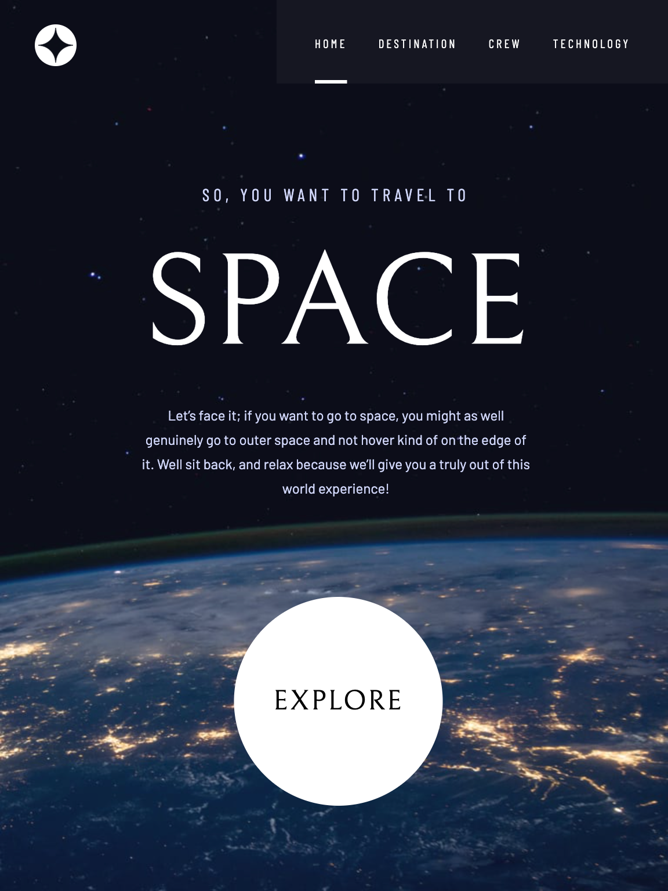

# Frontend Mentor - Space tourism website solution

This is a solution to the [Space tourism website challenge on Frontend Mentor](https://www.frontendmentor.io/challenges/space-tourism-multipage-website-gRWj1URZ3). Frontend Mentor challenges help you improve your coding skills by building realistic projects.

## Table of contents

- [Frontend Mentor - Space tourism website solution](#frontend-mentor---space-tourism-website-solution)
  - [Table of contents](#table-of-contents)
  - [Overview](#overview)
    - [Screenshot](#screenshot)
    - [Links](#links)
  - [My process](#my-process)
    - [Built with](#built-with)

## Overview

### Screenshot

### Links

- Solution URL: [Press this link](https://www.frontendmentor.io/solutions/space-tourism-website-using-astro-and-react-2OWzAABagy)
- Live Site URL: [Press this link](https://extraordinary-faloodeh-68a4ca.netlify.app/)

## My process

### Built with

- [React](https://reactjs.org/) - React framework
- [Astro](https://astro.build/) - Astro framework
- [tailwindcss](https://tailwindcss.com/) - For styles
